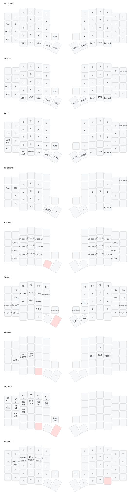

# Default keymap


# OLED status screen (`sofle_status` shield)

Both OLEDs run a custom status screen from `boards/shields/sofle_status/`, added
to each half in `build.yaml` alongside `sofle_left` / `sofle_right`.

```
  left half (central)          right half (peripheral)
  +------------------------+   +------------------------+
  | BLE/USB       battery  |   | conn          battery  |
  | layer        C _ A _   |   | CAPS                   |
  +------------------------+   +------------------------+
```

The modifier row shows one slot per modifier — `C`trl, `S`hift, `A`lt, `G`ui —
which displays its letter while the modifier is held and `_` when it is not.
Left and right variants share a slot, so either Ctrl lights the same `C`.
`CAPS` on the right half tracks the host's caps lock LED.

## Why the modifiers are on the left half and caps lock is on the right

This split is forced by ZMK, not by preference.

Modifier state comes from `zmk_hid_get_explicit_mods()`, refreshed on the
`zmk_keycode_state_changed` event. That event is only ever raised by keymap
behaviors (`behavior_key_press.c` and friends), and the keymap only runs on the
**central** half — the peripheral just reports key positions over BLE. The split
protocol has no command to relay modifier state either; the central-to-peripheral
command set is a fixed enum in ZMK core (`include/zmk/split/transport/types.h`).
So modifier indicators can only exist on the central half, which for the Sofle
shield is the left one.

Caps lock is the exception, because ZMK does relay it. The host's LED report
reaches the central, which forwards it to the peripheral when built with
`CONFIG_ZMK_SPLIT_PERIPHERAL_HID_INDICATORS=y`; the peripheral then raises
`zmk_hid_indicators_changed` locally. Both options are set in `config/sofle.conf`
and are required on **both** halves.

## Moving things around

- Caps lock on the left half too: `CONFIG_SOFLE_STATUS_WIDGET_CAPS=y` in
  `config/sofle.conf` (it defaults to peripheral-only).
- Turn the modifier row off: `CONFIG_SOFLE_STATUS_WIDGET_MODIFIERS=n`.
- Positions are set with `lv_obj_align()` calls in `custom_status_screen.c`.
- To get the modifier indicators onto the *right* OLED instead, the right half
  has to become the central one: add `CONFIG_ZMK_SPLIT_ROLE_CENTRAL=y` to a
  `config/sofle_right.conf` and `=n` to `config/sofle_left.conf`. That also moves
  the USB cable and the ZMK Studio connection to the right half, and requires
  re-pairing both halves.

The custom screen replaces ZMK's built-in one, so the battery, output/connection
and layer widgets are re-requested in the shield's `Kconfig.defconfig` to keep
what the built-in screen used to show.
